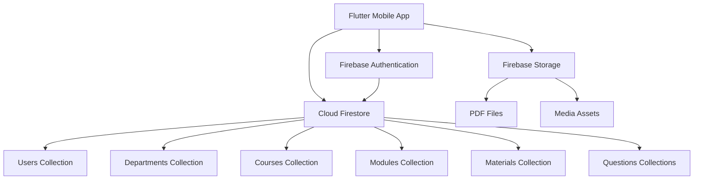
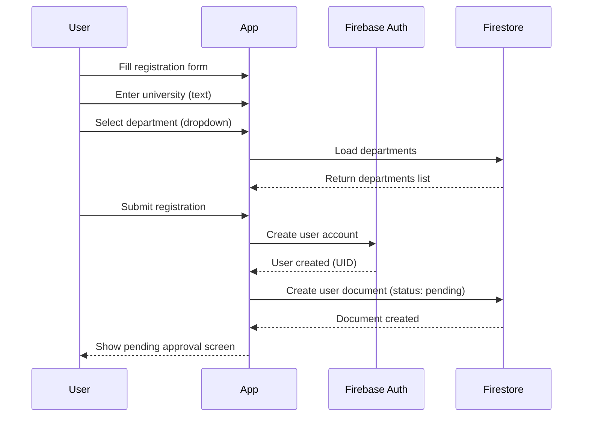
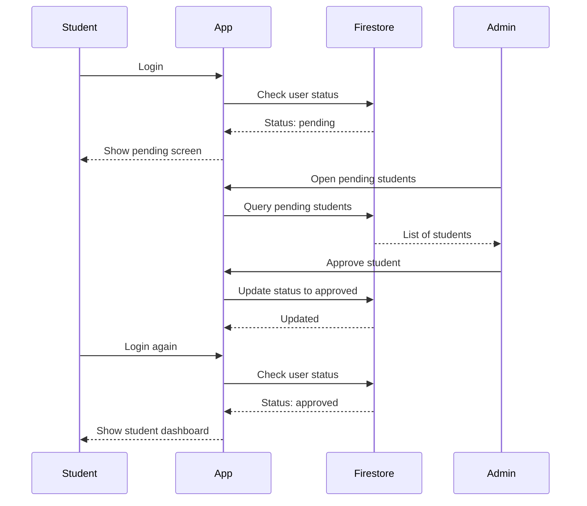
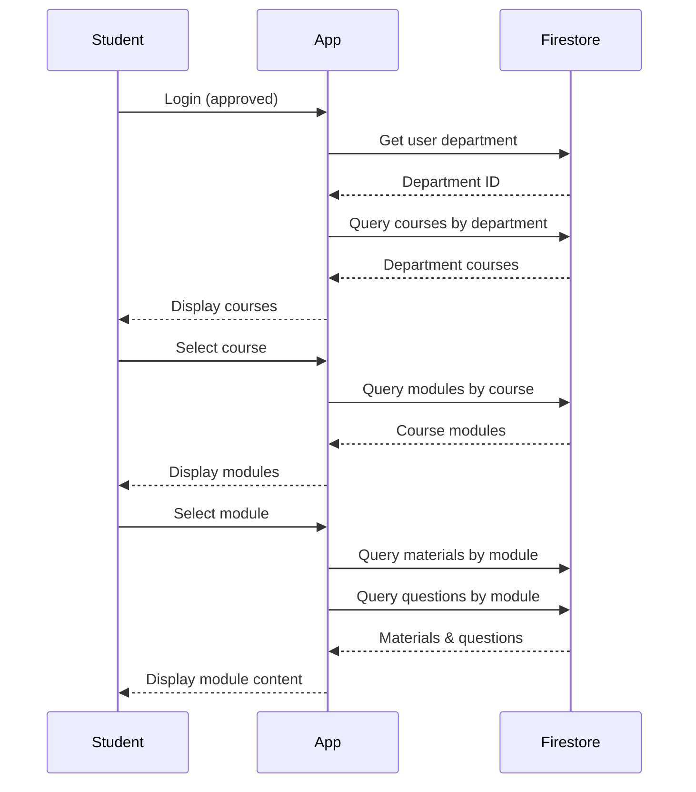
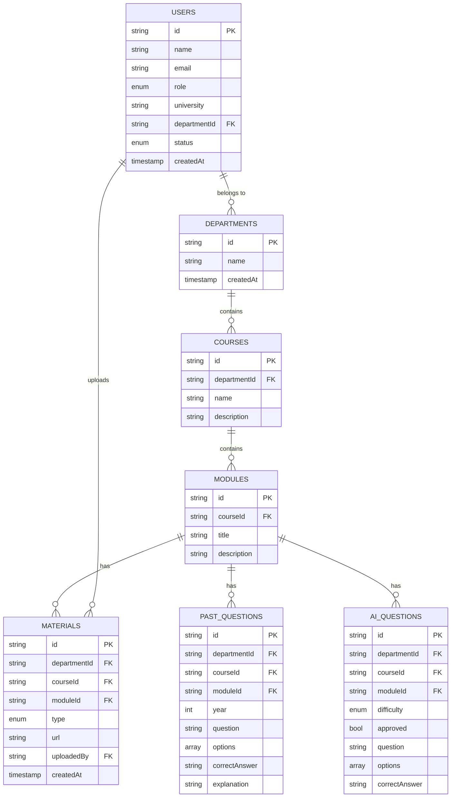
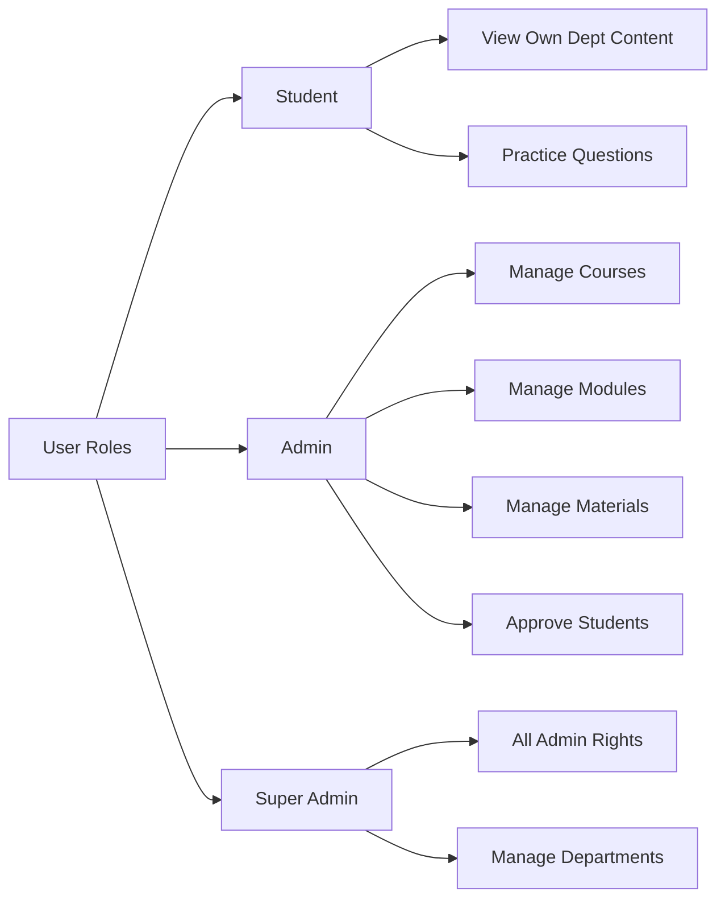
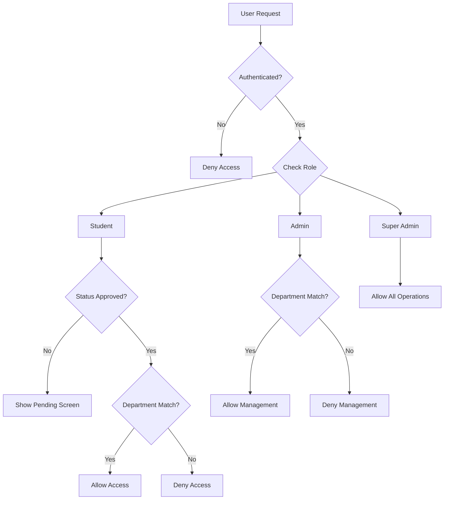
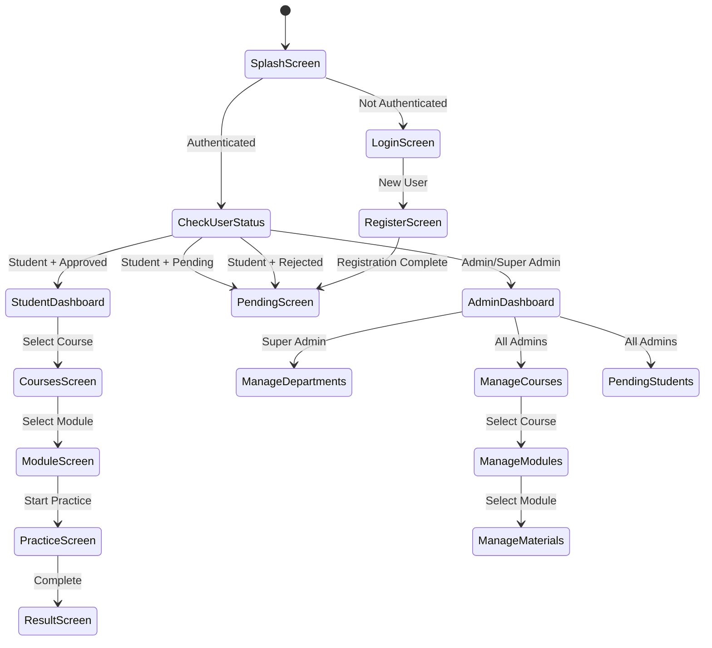
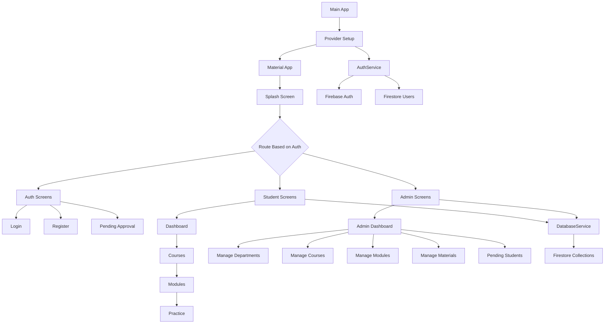
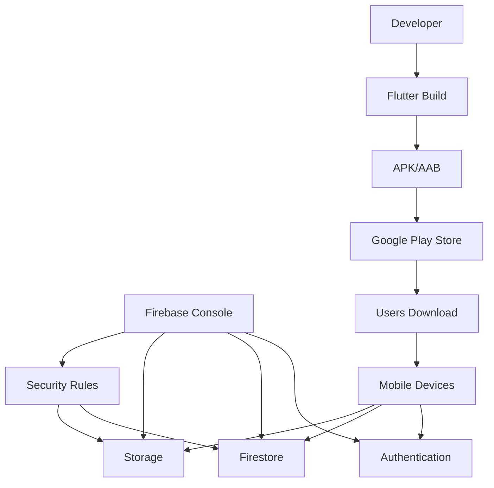

# System Architecture Diagrams

## Overall System Architecture

## User Flow Diagrams

### Registration Flow

### Approval Flow

### Student Content Access Flow

## Data Model Relationships

## Role-Based Access Control

## Security Architecture

## Application State Flow

## Component Architecture

## Deployment Architecture

## How to View These Diagrams

These diagrams are written in Mermaid syntax. To view them:

1. **GitHub**: Automatically renders Mermaid in markdown files
2. **VS Code**: Install "Markdown Preview Mermaid Support" extension
3. **Online**: Use [Mermaid Live Editor](https://mermaid.live/)
4. **Documentation Sites**: Most support Mermaid (GitBook, Docusaurus, etc.)

## Diagram Descriptions

### Overall System Architecture
Shows the high-level components and their relationships.

### User Flow Diagrams
Illustrate the sequence of interactions for key user journeys.

### Data Model Relationships
Entity-relationship diagram showing Firestore collections and their connections.

### Role-Based Access Control
Shows the permission hierarchy and what each role can do.

### Security Architecture
Decision tree for access control and security checks.

### Application State Flow
State machine showing navigation between screens.

### Component Architecture
Hierarchical view of the app's component structure.

### Deployment Architecture
Shows how the app is deployed and connects to Firebase services.
